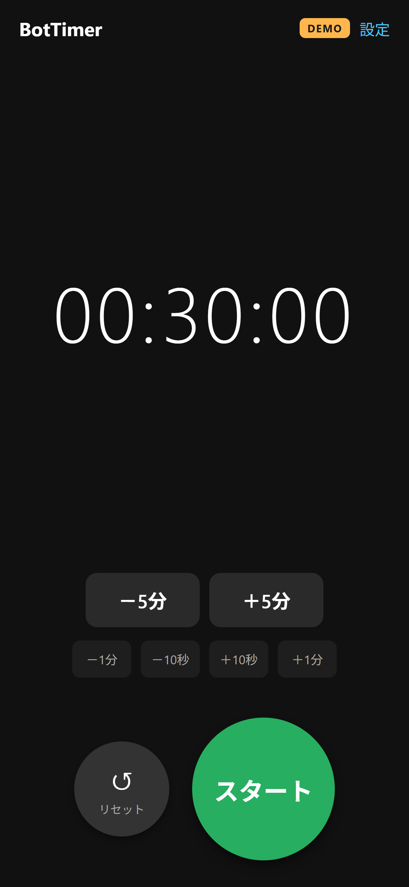
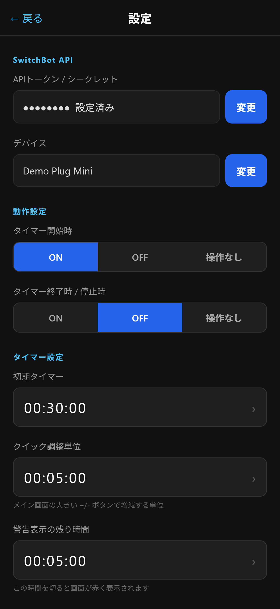
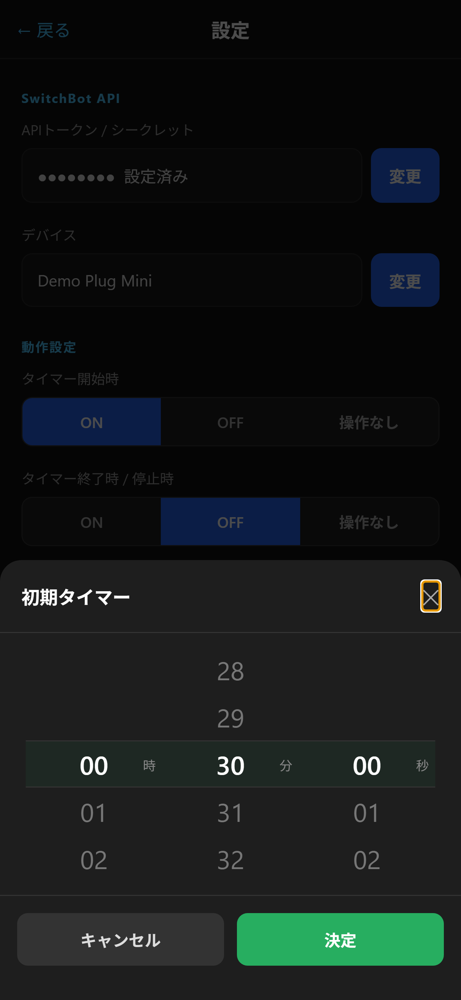
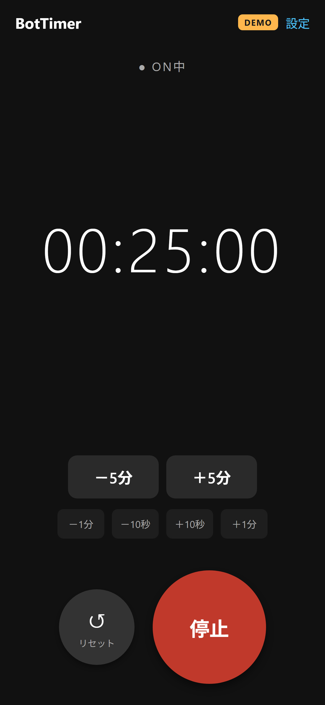

# BotTimer

**BotTimer** は SwitchBot 機器をタイマーで ON/OFF 制御できる非公式コンパニオンアプリです。

> This app is not affiliated with or endorsed by SwitchBot Inc.  
> SwitchBot is a trademark of SwitchBot Inc.

---

## ダウンロード / Download

| プラットフォーム | リンク |
|---|---|
| iOS (App Store) | 審査中 / Coming soon |
| Android (APK) | [ダウンロードページ](https://nnakimasa.github.io/BotTimer/) |

---

## スクリーンショット

<p align="center">
  
  
  
  
  
</p>

---

## 主な機能

- SwitchBot 機器（プラグミニ等）を指定時間後に ON/OFF
- タイマー終了時のローカル通知（アプリがバックグラウンドでも動作）
- ロックモード：タイマー画面のみ表示し誤操作を防止
- 繰り返し間隔設定
- デモモード：SwitchBot 機器なしで全機能を試せる
- 縦・横画面対応

---

## 必要なもの

- SwitchBot 機器（例：プラグミニ）
- SwitchBot アプリの API トークンとシークレットキー

API トークンの取得方法は[サポートページ](https://nnakimasa.github.io/bottimer-privacy/support.html)をご覧ください。

---

## 開発者向け

### 技術スタック

- [Expo SDK 54](https://expo.dev/) + React Native
- TypeScript
- EAS Build

### セットアップ

```bash
git clone https://github.com/nnakimasa/BotTimer.git
cd BotTimer
npm install
npx expo start
```

### APK / IPA ビルド

```bash
# Android APK
eas build --platform android --profile preview

# iOS (requires Apple Developer account)
eas build --platform ios --profile preview
```

---

## リンク

- [ライセンス](./LICENSE)
- [サポート・お問い合わせ](https://nnakimasa.github.io/bottimer-privacy/support.html)
- [プライバシーポリシー](https://nnakimasa.github.io/bottimer-privacy/)
- [Android ダウンロードページ](https://nnakimasa.github.io/BotTimer/)
- [セキュリティポリシー](./SECURITY.md)
